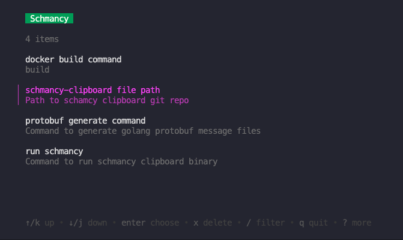

# Schmancy

Copy items to clipboard.

Created with Go and bubble-tea.



## Running

You must provide an opts.json config file. The shape of the json file should follow opts.json in the git repo.

Run the binary with the command, changing the env variable to where you placed the options file and the path to where you placed the binary

```bash
OPTS_PATH="/path/to/opts.json" /path/to/schmancy-clipboard
```
